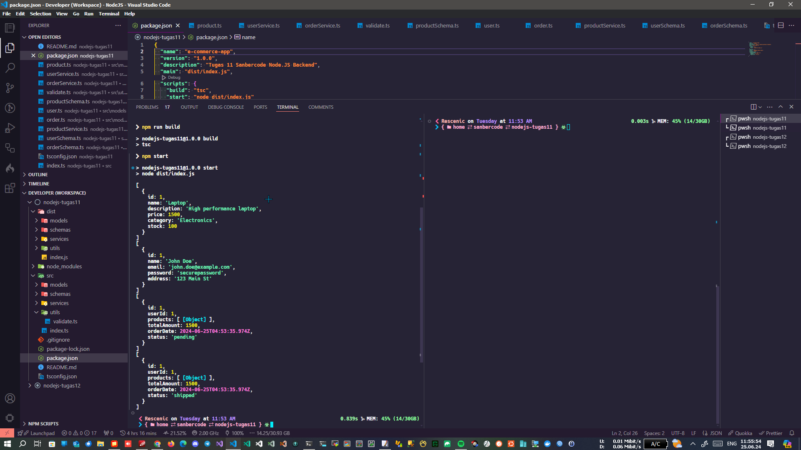

# Tugas 11 Sanbercode - Node.JS Backend

## Muhammad Ridwan Hakim

### Deploy Localhost

```bash
git clone https://github.com/rescenic/nodejs-tugas11.git

cd nodejs-tugas11

# E-Commerce App

A simple e-commerce application using TypeScript

## Getting Started

1. Install dependencies: `npm install`
2. Build the project: `npm run build`
3. Start the application: `npm start`
```

### Screenshots


